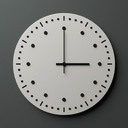

# clock-chrome-extention

    

**Extension Name: Analog & Digital Clock with Active Tab Info**

**Description:**
Enhance your browsing experience with the Analog & Digital Clock with Active Tab Info Chrome extension. This handy tool not only displays a stylish analog and digital clock but also provides real-time information about your active tab.

**Features:**

1. **Active Tab Information:**

   - Automatically displays the ID of your current active tab.
   - Simple and efficient script to query the active tab and inject the information into the extension's interface.

2. **Analog Clock:**

   - A visually appealing analog clock with smooth transitions.
   - Hour, minute, and second hands rotate precisely to show the current time.

3. **Digital Clock:**
   - Displays the current time in a digital format.
   - Shows hours, minutes, and seconds with a clear AM/PM indicator.
   - Automatically converts the 24-hour format to a 12-hour format.
   - Ensures leading zeros for single-digit hours, minutes, and seconds for a consistent display.

**How It Works:**

- The extension queries the active tab and displays its ID directly within the extension interface.
- The analog clock uses CSS transformations to rotate the hour, minute, and second hands accurately.
- The digital clock updates every second, reflecting the current time and adjusting for AM/PM format.

Stay informed and on time with this elegant and functional extension. Perfect for users who need quick access to time and tab information without leaving their current page.

**Permissions:**

- Access to active tabs to retrieve and display tab ID information.
- Scripting capabilities to inject necessary scripts for displaying tab information.

Enjoy a seamless blend of functionality and style with the Analog & Digital Clock with Active Tab Info extension. Install now and elevate your browsing experience!
