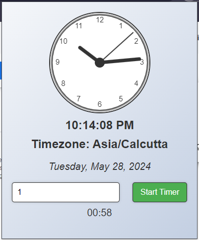

# Time Utils Chrome Extension

 - [chrome extentsion link](https://chromewebstore.google.com/detail/time-utils/mdmehkihncaoechbkoghbpdpopbhgopi)

Time Utils is a Chrome extension that provides an analog and digital clock with the current date and timezone information. It also includes a session timer to help you stay focused on your tasks. When the timer ends, you receive a notification along with a fun party poppers animation.

## Features

- **Analog and Digital Clock**: Displays the current time in both analog and digital formats.
- **Date and Timezone**: Shows today's date and your current timezone.
- **Session Timer**: Set a timer to help you focus on your tasks. The timer runs in the background even if the extension popup is closed.
- **Notifications**: Get notified when your timer session is complete with a festive party poppers animation.

## Usage

1. Click on the Time Utils icon in the Chrome toolbar to open the extension popup.
2. View the current time, date, and timezone information.
3. Set a session timer by entering the desired duration in minutes and clicking "Start Timer".
4. The timer will continue to run in the background even if you close the popup.
5. When the timer ends, you will receive a notification, and a party popper animation will appear.

## Screenshots

## Contributing

I welcome contributions to improve this extension! If you have any suggestions, bug reports, or feature requests, please open an issue or submit a pull request.

## License

This project is licensed under the MIT License. See the [LICENSE](LICENSE) file for more details.

## Credits

- Clock icon by [Bard](https://gemini.google.com/chat)
- Party popper animation from [giphy](https://giphy.com/gifs/love-happy-confetti-m3Xk0dVHrQTiaKvRWA).

---

Thank you for using Time Utils! Stay focused and make the most of your time.
